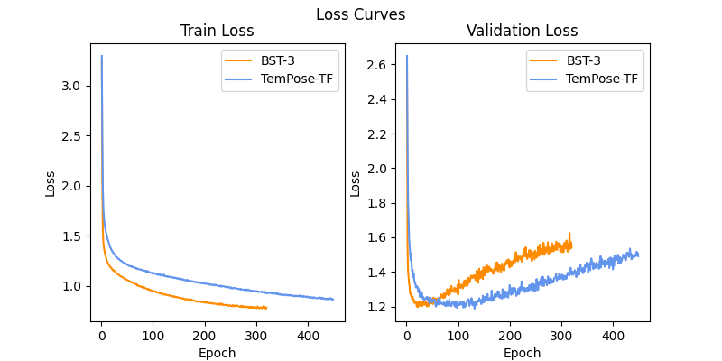

# BST: Badminton Stroke-type Transformer for Skeleton-based Action Recognition in Racket Sports
[](https://arxiv.org/abs/2502.21085)

[](https://www.python.org/downloads/) [](https://pytorch.org/)

## Abstract
Badminton, known for having the fastest ball speeds among all sports, presents significant challenges to the field of computer vision, including player identification, court line detection, shuttlecock trajectory tracking, and player stroke-type classification.
In this paper, we introduce a novel video segmentation strategy to extract frames of each player's racket swing in a badminton broadcast match.
These segmented frames are then processed by two existing models: one for Human Pose Estimation to obtain player skeletal joints, and the other for shuttlecock trajectory detection to extract shuttlecock trajectories.
Leveraging these joints, trajectories, and player positions as inputs, we propose Badminton Stroke-type Transformer (BST) to classify player stroke-types in singles.
To the best of our knowledge, experimental results demonstrate that our method outperforms the previous state-of-the-art on the largest publicly available badminton video dataset, ShuttleSet, which shows that effectively leveraging ball trajectory is likely to be a trend for racket sports action recognition.

**Keywords:** Deep learning, Transformer, Skeleton-based Action Recognition, Stroke classification, Badminton

## Main Results


## Results on 25% Training Set

## Training Speed
- On a NVIDIA RTX 4070 Ti Super setup, training **BST-3** takes 29 sec per epoch, while training **TemPose-TF** takes 31 sec per epoch.
- The following figure shows training **BST-3** converges faster than **TemPose-TF**:

    

## Classes in this Modified ShuttleSet
- `flaw_shot_records.csv` shows some errors in the original [ShuttleSet](https://github.com/wywyWang/CoachAI-Projects/tree/main/ShuttleSet).
- After modifying the original [ShuttleSet](https://github.com/wywyWang/CoachAI-Projects/tree/main/ShuttleSet), remaining strokes are obtained and shown in the table below.
- For more details, please see `class_total.xlsx`.

    | Class ID | Num of Strokes | Player | 中文類別名稱 | Class Name |
    | -------: | -----------: | :----: | :---------- | :--------- |
    | 0        | 2982         | Top    | 放小球       | net shot   |
    | 1        | 1618         | Top    | 擋小球       | return net |
    | 2        | 1287         | Top    | 殺球         | smash      |
    | 3        | 831          | Top    | 點扣         | wrist smash|
    | 4        | 2343         | Top    | 挑球         | lob        |
    | 5        | 123          | Top    | 防守回挑     | defensive return lob |
    | 6        | 1309         | Top    | 長球         | clear      |
    | 7        | 319          | Top    | 平球         | drive      |
    | 8        | 234          | Top    | 後場抽平球   | back-court drive |
    | 9        | 1036         | Top    | 切球         | drop       |
    | 10       | 615          | Top    | 過渡切球     | passive drop |
    | 11       | 1317         | Top    | 推球         | push       |
    | 12       | 270          | Top    | 撲球         | rush       |
    | 13       | 144          | Top    | 防守回抽     | defensive return drive |
    | 14       | 606          | Top    | 勾球         | cross-court net shot |
    | 15       | 904          | Top    | 發短球       | short service |
    | 16       | 159          | Top    | 發長球       | long service |
    | 17       | 2842         | Bottom | 放小球       | net shot   |
    | 18       | 1756         | Bottom | 擋小球       | return net |
    | 19       | 1075         | Bottom | 殺球         | smash      |
    | 20       | 728          | Bottom | 點扣         | wrist smash|
    | 21       | 2536         | Bottom | 挑球         | lob        |
    | 22       | 155          | Bottom | 防守回挑     | defensive return lob |
    | 23       | 1352         | Bottom | 長球         | clear      |
    | 24       | 335          | Bottom | 平球         | drive      |
    | 25       | 201          | Bottom | 後場抽平球   | back-court drive |
    | 26       | 943          | Bottom | 切球         | drop       |
    | 27       | 583          | Bottom | 過渡切球     | passive drop |
    | 28       | 1335         | Bottom | 推球         | push       |
    | 29       | 201          | Bottom | 撲球         | rush       |
    | 30       | 238          | Bottom | 防守回抽     | defensive return drive |
    | 31       | 620          | Bottom | 勾球         | cross-court net shot |
    | 32       | 954          | Bottom | 發短球       | short service |
    | 33       | 200          | Bottom | 發長球       | long service |
    | 34       | 1278         | -      | 未知球種     | none       |

## Reproducing the Results
### Generating Stroke Clips
(In `ShuttleSet` folder)
1. Download the videos from links in `set/match.csv` and put them into `raw_video` folder.
    - `flaw_shot_records.csv` shows some errors in the original [ShuttleSet](https://github.com/wywyWang/CoachAI-Projects/tree/main/ShuttleSet), so please use the modified version in this repository.
    - Append each video ID to the front of its name, such as `<ID> - <name>.mp4`.
2. Modify `my_raw_video_resolution.csv` to the resolutions you downloaded.
3. Run `gen_my_dataset.py` 6 (2 players x 3 splitted sets) times, and please check the following settings in the code each time:
    - `out_root_dir`: output root directory.
    - `player`: Top / Bottom.
    - `set_name`: train / val / test.
    - `type_ls`: each element should be the same class name as in ShuttleSet.
    - `strategy`: please check if it matches the `out_root_dir` or not.
4. Move all clips in `Top_小平球` or `Bottom_小平球` to `未知球種`, which means "None" type, and delete these empty folders.
5. Remove all the clips labeled "removed" in `flaw_shot_records.csv`.
    - Make sure the total number of the clips each type is the same as that shown in `class_total.xlsx`.

Thus, we have stroke clips now.

### Data Preprocessing
(In `stroke_classification` folder)
1. Make sure your shuttlecock tracking model works well, you can choose the one you like:
    - [TrackNetV3 (using attension)](https://github.com/alenzenx/TrackNetV3) $\Leftarrow$ used in this paper.
    - [TrackNetV3 (with rectification module)](https://github.com/qaz812345/TrackNetV3).
2. Make sure your [MMPose](https://github.com/open-mmlab/mmpose/tree/main) works well.
    - Set your `venv_prepare_train` virtual environment first for running Human Pose Estimation (HPE) successfully.
    - See `prepare_train_env.txt` as an example based on my setup.
3. Run 1-3 steps in `prepare_train.py` individually.
    - Check data paths first.
    - For step 1: check the parameters are being passed into your shuttlecock tracking model.
    - For step 2: I don't recommend using 3D poses because there are still some bugs using MMPose 3D pose API.
    - For step 3: set `seq_len` to `30` if using fixed-width clipping strategy, otherwise `100`.

Thus, we have collated .npy files now.

### Training Classification Models
(In `stroke_classification` folder)
- Run each `<architecture_name>_main.py` for training, validating, testing each model, and please check hyper-parameters:
    - `hyp.seq_len`: should be the same as in your dataset.
    - `train_partial`: `1` for the whole training set.
    - `model_name`
        - `ShuttlePose_3_3`: **BST-0** in this paper.
        - `BST_6_2`: **BST-1** in this paper.
        - `BST_7`: **BST-2** in this paper.
        - `BST_8`: **BST-3** in this paper.
    - `in_channels`: `2` for 2D, `3` for 3D.
    - `model_info`: to distinguish your model weights.
    - `serial_no`: to distinguish your model weights when trying different initial weights.

## Citation
```
@misc{chang2025bstbadmintonstroketypetransformer,
      title={BST: Badminton Stroke-type Transformer for Skeleton-based Action Recognition in Racket Sports}, 
      author={Jing-Yuan Chang},
      year={2025},
      eprint={2502.21085},
      archivePrefix={arXiv},
      primaryClass={cs.CV},
      url={https://arxiv.org/abs/2502.21085}, 
}
```

## References
- Shuttlecock Trajectory
    - [TrackNetV3 (using attention)](https://github.com/alenzenx/TrackNetV3)
    - [TrackNetV3 (with rectification module)](https://github.com/qaz812345/TrackNetV3)
- Human Pose Estimation
    - [MMPose](https://github.com/open-mmlab/mmpose/tree/main)
- Classification Models
    - [ST-GCN](https://github.com/yysijie/st-gcn)
    - [BlockGCN](https://github.com/ZhouYuxuanYX/BlockGCN)
    - [SkateFormer](https://github.com/KAIST-VICLab/SkateFormer)
    - [ProtoGCN](https://github.com/firework8/ProtoGCN)
    - [TemPose](https://github.com/MagnusPetersenIbh/TemPose-BadmintonActionRecognition)
- Dataset
    - [ShuttleSet](https://github.com/wywyWang/CoachAI-Projects/tree/main/ShuttleSet)
- Court Detection (if the dataset does not contain court information)
    - [MonoTrack](https://github.com/jhwang7628/monotrack)
